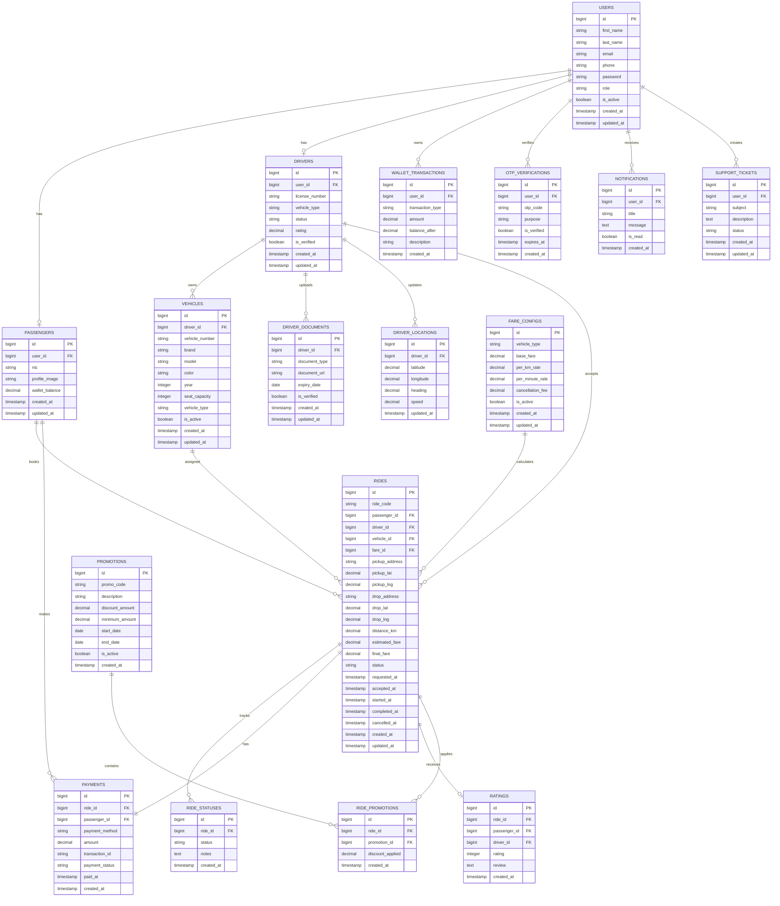

# Ride Hailing System ER Diagram (Mermaid)



## Main Modules

1. User Management
2. Passenger Management
3. Driver Management
4. Vehicle Management
5. Ride Booking System
6. Live Driver Tracking
7. Payment & Wallet System
8. Ratings & Reviews
9. OTP Authentication
10. Promotions & Discounts
11. Notifications
12. Support Ticket System

## Ride Status Flow

```text
REQUESTED
→ ACCEPTED
→ ARRIVED
→ STARTED
→ COMPLETED

or

REQUESTED
→ CANCELLED
```

## Recommended Technologies

- Backend: Laravel 12
- Database: MySQL / PostgreSQL
- Realtime Tracking: WebSocket + Redis
- Queue System: Laravel Queue + Redis
- Maps: Google Maps API
- Authentication: Laravel Sanctum / JWT
- Push Notifications: Firebase Cloud Messaging (FCM)
- Payment Gateway: Stripe / PayHere
- Storage: AWS S3 / Local Storage

## Realtime Driver Tracking Architecture

```text
Driver App
   ↓
WebSocket Server
   ↓
Redis Pub/Sub
   ↓
Laravel Backend API
   ↓
Passenger App Live Map
```

