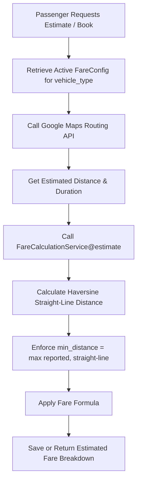
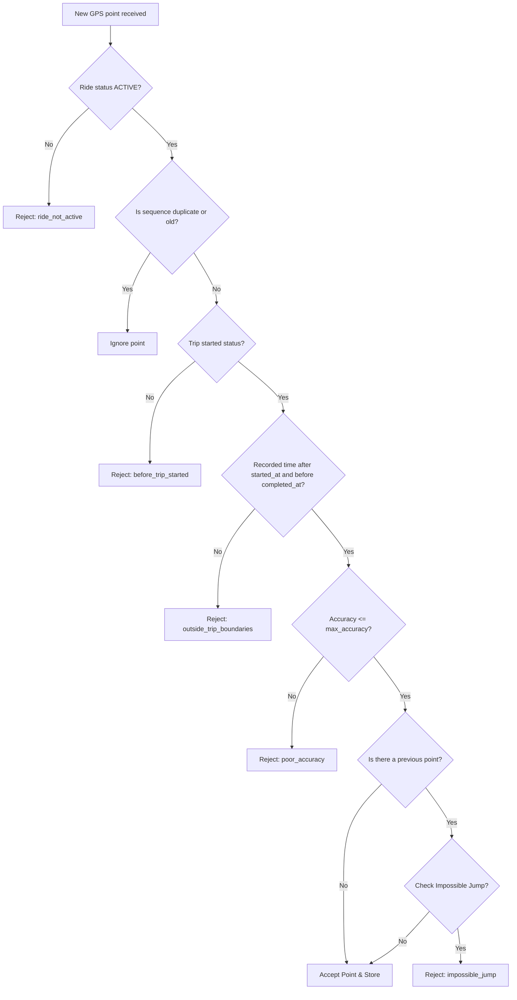

# PickYou Fare Configuration and Calculation Logic

This document details the database schema, business rules, API controllers, services, and mathematical formulas used to define and calculate ride fares in the PickYou application.

---

## 1. Fare Configurations Database Schema

Fare configurations are defined per vehicle type and stored in the `fare_configs` table. Each vehicle type (e.g., *Car, Tuk, Bike*) has its own set of pricing rates.

### Database Migration: `2026_05_06_044915_create_fare_configs_table.php`

| Column Name | Type | Description |
| :--- | :--- | :--- |
| `id` | `unsignedBigInteger` | Primary Key. |
| `vehicle_type` | `string` | The vehicle type name (e.g., `Car`, `Tuk`, `Bike`). |
| `base_fare` | `decimal(10,2)` | The minimum/initial fare charged for booking a ride. Default: `0.00`. |
| `per_km_rate` | `decimal(10,2)` | Charge rate per kilometer travelled. Default: `0.00`. |
| `per_minute_rate` | `decimal(10,2)` | Charge rate per minute of ride duration / waiting time. Default: `0.00`. |
| `cancellation_fee` | `decimal(10,2)` | Fee applied if a ride is cancelled under specific conditions. Default: `0.00`. |
| `is_active` | `boolean` | Flag indicating whether this configuration is currently active. Default: `false`. |
| `timestamps` | `timestamp` | `created_at` and `updated_at`. |

> [!NOTE]
> Only one **active** configuration is allowed per `vehicle_type` at any given time. This uniqueness is enforced at application-level in [FareConfigController.php](file:///c:/Users/NCCS/Desktop/pick_you/backend-api/app/Http/Controllers/Api/FareConfigController.php).

---

## 2. Admin Fare Management Lifecycle

Admin controls the fare configurations via `FareConfigController.php` under the route `/api/fare-configs` (protected by the `manage_fare_configs` permission middleware):

* **Index / Show**: Fetch all configurations or a specific one by ID.
* **Store / Update**: Creates or updates configurations.
* **Validation Rules**:
  * `vehicle_type`: Required, string.
  * `base_fare`, `per_km_rate`, `per_minute_rate`, `cancellation_fee`: Required, numeric, non-negative (`min:0`).
  * `is_active`: Optional, boolean. If set to `true`, the system checks for existing active configurations of the same `vehicle_type` and rejects the payload if a duplicate exists with status code `422`.

---

## 3. Pre-Book Ride Fare Estimation

When a passenger requests a fare estimate or books a ride (via `RideController@estimate` or `RideController@store`), the system performs an authoritative estimation.

### The Estimation Flow

### Calculation Formula

The estimate is calculated in [FareCalculationService.php](file:///c:/Users/NCCS/Desktop/pick_you/backend-api/app/Services/Fares/FareCalculationService.php#L12-L41):

1. **Straight-Line Distance Check**:
   $$\text{minimumDistanceKm} = \text{HaversineDistance}(\text{pickup}, \text{drop})$$
2. **Adjusted Distance & Duration**:
   $$\text{distanceKm} = \text{round}(\max(0, \text{reportedDistanceKm}, \text{minimumDistanceKm}), 2)$$
   $$\text{durationMinutes} = \text{round}(\max(0, \text{estimatedDurationMinutes}), 2)$$
3. **Fare Components**:
   $$\text{distanceFare} = \text{distanceKm} \times \text{per\_km\_rate}$$
   $$\text{durationFare} = \text{durationMinutes} \times \text{per\_minute\_rate}$$
4. **Estimated Fare**:
   $$\text{estimatedFare} = \text{round}(\text{base\_fare} + \text{distanceFare} + \text{durationFare}, 2)$$

---

## 4. Live Distance Tracking & GPS Filtering

During an ongoing ride (`STARTED` state), the driver's mobile app posts live GPS locations to `/api/driver-locations`. These are processed asynchronously in [RideLocationPointProcessor.php](file:///c:/Users/NCCS/Desktop/pick_you/backend-api/app/Services/Locations/RideLocationPointProcessor.php).

To prevent fare inflation due to GPS noise or anomalies, coordinates undergo strict validation:

### Point Acceptance Criteria

1. **Lifecycle Bounds**: Points are only accepted when the ride status is `STARTED` and the timestamp falls between `started_at` and `completed_at`.
2. **GPS Accuracy**: Points with accuracy values greater than `config('location.max_fare_accuracy_meters')` (default `100` meters) are rejected (`poor_accuracy`).
3. **Noisy Jumps & Teleportation**: The speed between successive points is calculated:
   $$\text{speed} = \frac{\text{distanceKm}}{\text{timeDifferenceSeconds} / 3600}$$
   If $\text{distanceKm} > \text{max\_point\_jump\_km}$ (default `2.0` km) or $\text{speed} > \text{max\_plausible\_speed\_kmh}$ (default `160` km/h), the point is rejected as `impossible_jump`.
4. **Incremental Distance Aggregation**:
   If the point is accepted, the distance from the previous accepted point (using Haversine) is added to the ride's `actual_distance_km`.

---

## 5. Ride Completion Fare Calculation

When the driver completes the ride (`RideController@completeRide`), the system transitions the ride to `COMPLETED` status and generates a final cost breakdown.

### Variables

* **$E_D$**: `estimated_distance_km` (initially computed using Google Maps)
* **$A_D$**: `actual_distance_km` (aggregated from accepted GPS points)
* **$E_F$**: `estimated_fare` (initial upfront fare shown to the passenger)
* **$T_W$**: `waiting_minutes` (time between the driver's arrival and trip start)
* **$G_W$**: `waiting_grace_minutes` (configured grace period, default: `5` minutes)

### Formulas

1. **Extra Distance**:
   $$\text{extraDistanceKm} = \max(0, A_D - E_D)$$
   $$\text{extraDistanceFare} = \text{round}(\text{extraDistanceKm} \times \text{per\_km\_rate}, 2)$$
2. **Chargeable Waiting Time**:
   $$\text{chargeableWaitingMinutes} = \text{round}(\max(0, T_W - G_W), 2)$$
   $$\text{waitingFare} = \text{round}(\text{chargeableWaitingMinutes} \times \text{per\_minute\_rate}, 2)$$
3. **Final Fare Safeguard**:
   $$\text{finalFare} = \text{round}(\max(E_F, E_F + \text{extraDistanceFare} + \text{waitingFare}), 2)$$

> [!IMPORTANT]
> **Upfront Fare Guarantee**: The final fare is guaranteed to never drop below the initial upfront estimated fare ($E_F$). If the actual distance is shorter than estimated, or if the driver starts the ride early with minimal wait time, the passenger is billed the original estimate. Additional charges are applied only for route deviations/longer paths ($\text{extraDistanceKm} > 0$) and wait times exceeding the grace threshold ($T_W > 5$ min).

---

## 6. Mathematical Helper Functions

Distance calculations rely on the **Haversine formula** to compute great-circle distances between two geographic coordinates:

$$\Delta\text{lat} = \text{deg2rad}(\text{lat}_2 - \text{lat}_1)$$
$$\Delta\text{lng} = \text{deg2rad}(\text{lng}_2 - \text{lng}_1)$$
$$a = \sin^2\left(\frac{\Delta\text{lat}}{2}\right) + \cos(\text{deg2rad}(\text{lat}_1)) \cdot \cos(\text{deg2rad}(\text{lat}_2)) \cdot \sin^2\left(\frac{\Delta\text{lng}}{2}\right)$$
$$d = 2 \cdot \text{EarthRadiusKm} \cdot \text{atan2}(\sqrt{a}, \sqrt{1 - a})$$

* $\text{EarthRadiusKm} = 6371.0$
