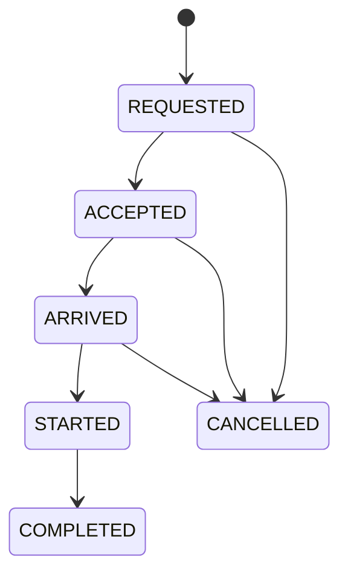
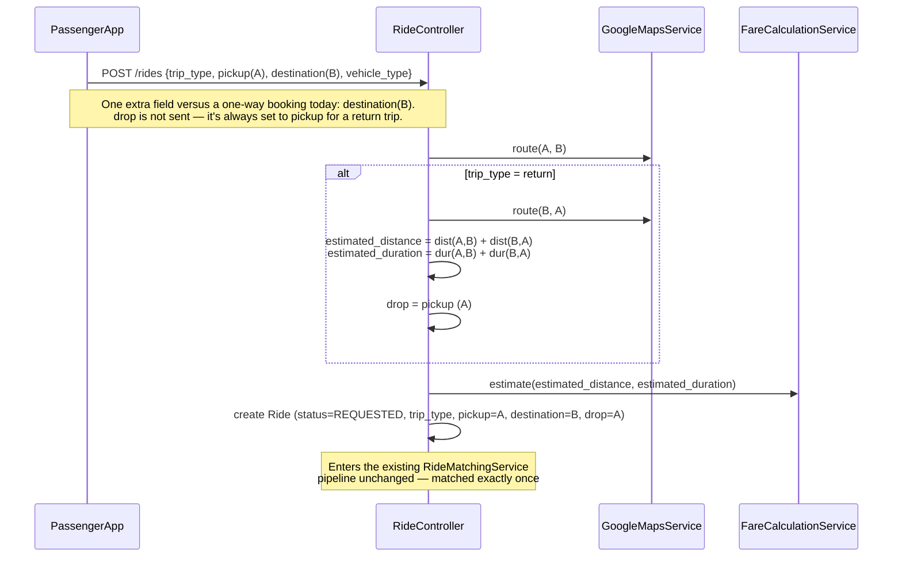
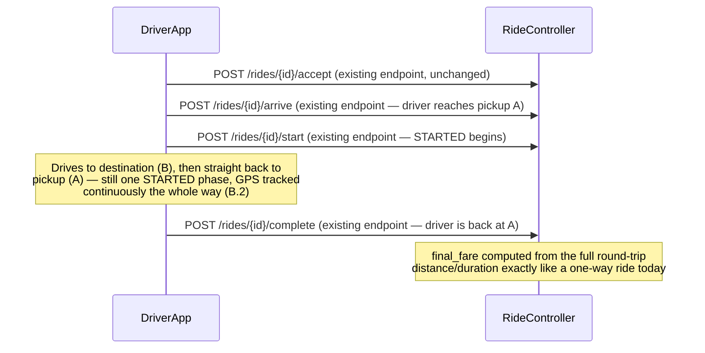
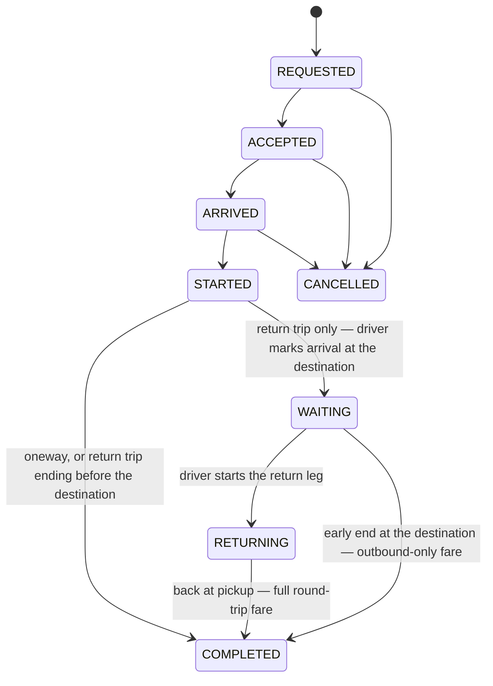

# Return Trip Feature — Implementation Plan

This document covers (1) how the current PickYou architecture handles ride matching, Google
Maps routing, Redis, and queues — the machinery a Return Trip feature must build on — and
(2) the full design for the feature itself.

> [!NOTE]
> **Status: implemented**, including the follow-up lifecycle described in **Part D** —
> explicit "arrived at destination" / "start return leg" driver actions, and an early-end
> at the destination billed only for the outbound distance. Part B below (WAITING/RETURNING
> removed for simplicity) is **superseded by Part D**; kept for history. Backend (migration,
> `Ride` model, `RideController`, `RideStateMachine`, `RideTransitionService`,
> `FareCalculationService`, `RideLocationPointProcessor`, `RideRequestedTargeted` broadcast),
> PassengerApp (booking flow, `select-vehicle.tsx`, `confirm.tsx`, `matching.tsx`,
> `ReturnTripLocationPicker.tsx`), and DriverApp (`IncomingRideModel.js`,
> `RideDetailsScreen.js`, `TripInProgressScreen.js`, `rideLocation.js`) are all wired up.
> PHP lint, PassengerApp `tsc --noEmit`, and DriverApp `eslint` all pass clean. **Not yet
> done:** running the new migrations against a real database (left for the user to run —
> touches persisted schema), and a live end-to-end run of both mobile apps against a live
> backend with real Google Maps/Redis/Reverb.

---

## Part A — Current Architecture (research summary)

### A.1 Ride domain model & state machine

`Ride` (`backend-api/app/Models/Ride.php`) is **one row per one-way trip**: single
`passenger_id`, `driver_id`, `vehicle_id`, one pickup point, one drop point. There is no
`parent_ride_id`, `leg_number`, `waypoints`, or any multi-leg concept in the schema today.

Key columns: `ride_code`, pickup/drop as PostGIS `geography(Point,4326)` (`pickup_geog`,
`drop_geog`), `distance_km` / `estimated_distance_km` / `actual_distance_km`,
`estimated_duration_minutes` / `actual_duration_minutes`, fare breakdown fields
(`waiting_minutes`, `chargeable_waiting_minutes`, `extra_distance_km`, `extra_distance_fare`,
`waiting_fare`, `estimated_fare`, `final_fare`, `fare_breakdown` json), `payment_method`,
commission snapshot (`commission_rate`, `commission_amount`, `driver_earning` — see
[commission_and_driver_accounts.md](commission_and_driver_accounts.md)), and lifecycle
timestamps (`requested_at`, `accepted_at`, `arrived_at`, `started_at`, `completed_at`,
`cancelled_at`).

State machine (`app/Services/Rides/RideStateMachine.php`), every transition written to
`rides.status` and appended to the `ride_statuses` audit log via `RideTransitionService`:



`RideController` exposes `store`, `estimate`, `acceptRide`, `arriveRide`, `startRide`,
`completeRide`, `rejectRide`, `cancel`, `driverRideRequests`, `show`.

**Already present but disconnected** — the frontend has scaffolding for exactly this feature
with no backend behind it:

| File | State |
|---|---|
| `PassengerApp/features/ride-booking/TripTypeToggle.tsx` | UI toggle `oneway` \| `return`, not wired to any API field |
| `PassengerApp/state/booking/RideBookingContext.tsx` | Already has `tripType`, separate `outboundTrip` / `returnTrip` objects, `scheduledAt` — all unused |
| `PassengerApp/app/ride-booking/return-location.tsx`, `select-return-vehicle.tsx` | Screens exist; return pickup/drop are never actually populated before reaching vehicle selection |
| `PassengerApp/app/ride-booking/schedule.tsx` | Stub screen; contains the comment *"Current backend booking remains instant until scheduled rides are supported server-side"* |

So the mobile-side product shape was already anticipated — this plan makes it real end to end,
in the simplified single-ride form settled on below (B.2).

### A.2 Google Maps / routing

`app/Services/Maps/GoogleMapsService.php` wraps Places Autocomplete (New), Place Details
(New), legacy Geocoding, and Routes API v2 `computeRoutes`. The one method that matters here
is `route($originLat, $originLng, $destLat, $destLng)` → normalized
`{distance, duration, polyline, distanceText, durationText}`, **cached in Redis** under
`google-route-v2:{origin}:{dest}` (TTL from `config('google_maps.route_cache_ttl_seconds')`,
default 300s), with a haversine-based `fallbackRoute()` (×1.28 fudge factor) if the API call
fails. `RideController::store()`/`estimate()` call this once per pickup→drop pair and feed it
into `FareCalculationService::estimate()`. Nothing about it assumes a ride only ever travels
one direction — it's a pure `(origin, dest) → distance/duration` function, so a return trip
simply calls it twice (A→B, then B→A), each leg independently cached.

### A.3 Redis usage (four distinct roles)

| Role | Keys | File |
|---|---|---|
| **Matching queue / offer state** | `ride:matching_drivers:{rideId}` (list of candidates), `ride:current_driver:{rideId}` (TTL'd current offer), `ride:offer_expires_at:{rideId}`, `driver:current_rides:{driverId}` (set) | `RideMatchingRedis.php` |
| **Driver geo (fallback only)** | `driver:location:{driverId}` (JSON, 60s TTL), `GEOADD drivers:online:geo` | `DriverLocationService.php` — PostGIS `ST_DWithin` is the *primary* proximity query; Redis `GEORADIUS` is fallback 1, raw-SQL haversine is fallback 2 |
| **Caching** | Google route/geocode cache (A.2), plus a location-snapshot debounce lock `driver:location:snapshot-lock:{driverId}` | Various |
| **Rejection cooldown** | Tracks drivers who declined a specific ride so they aren't re-offered it | `DriverRejectionCooldown.php` |

No pub/sub — real-time delivery is handled by Reverb broadcasting (A.5), not Redis.

### A.4 Queues / jobs

`QUEUE_CONNECTION=redis`. Six jobs in `app/Jobs/`, the relevant one being
**`ProcessRideTimeout`** — dispatched with `->delay($offerExpiresAt)` the moment a driver is
targeted; when it fires, if that driver is still the current target, it calls
`RideMatchingService::targetNextDriver()`. **This delayed-job-as-timer pattern is exactly the
mechanism the return-trip destination-wait timeout needs (B.10) — no new infrastructure
class, just one more job following the same shape.** Driver matching itself runs
**synchronously inline** in the request (not queued); only the timeout/re-target step is
queue-delay driven. Supervisor runs `laravel-workers:*` + `reverb` process groups per
`DEPLOY_GUIDE.md`.

### A.5 Driver matching & real-time delivery

`RideMatchingService` + `DriverMatchingQuery` find nearby eligible drivers (PostGIS primary,
Redis/SQL fallbacks), push them into the Redis list, and target one at a time with a
TTL'd offer window (default 20s, `ride.driver_offer_seconds`). Each offer:
1. Broadcasts `RideRequestedTargeted` (`ShouldBroadcastNow`) on private Reverb channel
   `driver.rides.{driverId}`.
2. Fires an Expo push notification as a backup for a backgrounded app.
3. Schedules `ProcessRideTimeout` to fire at the offer deadline.

`RideStatusUpdated` (channel `ride.{rideId}`) and `DriverLocationUpdated` (queued, same
channel) keep the passenger's screen live during the ride. This pipeline runs **once** per
return trip under the design below, since there's only ever one ride and one driver to match.

---

## Part B — Return Trip Feature Design

> [!NOTE]
> Simplified again per direct instruction: **no `WAITING`/`RETURNING` sub-states, no
> destination-wait fee, no extra endpoints.** The whole round trip — drive to destination,
> drive back to pickup, end — is one continuous `STARTED` phase, exactly like a one-way ride
> today. See B.3 for the (now much shorter) design.

### B.1 Scope — **DECIDED**

A return trip is one continuous booking with one driver, one vehicle, and — per the flow you
described — **one uninterrupted driving phase**: driver arrives at pickup, starts the ride,
drives to the destination, drives back to the pickup point, ends the ride. No separate
"waiting" status, no destination-side wait fee, no extra confirmation taps in the middle. It
is the existing one-way ride lifecycle, run out to a destination and back instead of stopping
at the destination.

| | This design |
|---|---|
| Driver | Same driver for the whole trip — one `driver_id`, matched once, exactly as today |
| Vehicle | One vehicle throughout |
| Locations | Pickup (A), a destination waypoint (B), and a drop that always equals A |
| Matching | Runs once — identical to a one-way ride |
| States | Identical to a one-way ride — no new statuses |
| Endpoints | Identical to a one-way ride — no new endpoints |

### B.2 Core model: one `Ride` row, same state machine — **DECIDED**

No second ride, no `ride_groups` table. A return trip is the same `rides` row as a one-way
trip, distinguished by a `trip_type` flag. The state machine is **completely unchanged**:


`STARTED` now simply covers more ground for a return trip — the driver drives A→B→A inside
one `STARTED` phase, then taps **complete** once, back at A, exactly the same action that
ends a one-way ride today. `RideTransitionService`, `RideController::acceptRide` /
`arriveRide` / `startRide` / `completeRide`, `RideMatchingService`, `PaymentController`, and
the commission ledger (`RideSettlementService`) need **zero changes** — there is still
exactly one ride, one driver, one continuous `STARTED`→`COMPLETED` span, one payment.

#### Where the destination (B) is stored — the one real schema question

`drop_*` on a return trip must hold **A** (the ride ends back at pickup — "pickup point,
drop point," as you put it), so `drop_*` can't also hold B the way it did in the earlier
two-location draft. B needs its own columns:

```php
$table->string('trip_type')->default('oneway');       // oneway | return
$table->string('destination_address')->nullable();
$table->decimal('destination_lat', 10, 7)->nullable();
$table->decimal('destination_lng', 10, 7)->nullable();
$table->point('destination_point')->nullable();
$table->geography('destination_geog', subtype: 'point', srid: 4326)->nullable();
```

(Same shape as the existing `pickup_*`/`drop_*` columns — nothing new architecturally, just
one more location on the row.) At creation time, for `trip_type = return`:

```
pickup_*      = A   (from passenger input, as today)
destination_* = B   (from passenger input — the one extra field this feature adds)
drop_*        = A   (auto-copied from pickup — the ride always ends where it started)
```

For `trip_type = oneway`, `destination_*` stays null and everything behaves exactly as it
does today.

`estimated_distance_km` / `estimated_duration_minutes` / `estimated_fare` become the **sum of
both legs** (Maps route A→B plus route B→A) — still the same single columns, just holding a
round-trip total. `actual_distance_km` / `actual_duration_minutes` accumulate via GPS
continuously across the whole `STARTED` phase — **no change** to
`RideLocationPointProcessor` at all, since there's no pause/status split to account for; the
driver is simply still `STARTED` while driving the second leg.

### B.3 Booking flow



### B.4 Trip lifecycle (return trip)



Every endpoint here already exists and is unmodified. The only backend change is what happens
inside `store()`/`estimate()` (B.3) — everything from `accept` through `complete` is the
identical code path a one-way ride uses today.

### B.5 Driver disclosure

The driver sees the destination and the fact that it's a round trip on the offer card before
accepting (`IncomingRideModel.js` / `RideDetailsScreen.js`):

> "Round trip via [destination] — returns to pickup."

No special commitment beyond a normal ride — they either accept the whole loop or decline,
exactly like any offer today; `RideMatchingService` falls through to the next candidate on a
decline with no changes needed.

### B.6 Map / route rendering

The one genuinely new frontend behavior: showing an out-and-back route (A→B→A) instead of a
single leg. `RideController::estimate()`/`store()` responses should include both legs'
polylines (`route(A,B).polyline` and `route(B,A).polyline`) so `react-native-maps` can draw
the full loop on both the passenger's confirmation screen and the driver's in-trip map — this
is display-only, layered on the two `GoogleMapsService::route()` calls already being made for
the fare estimate (A.2); no additional Maps API usage beyond what B.3 already calls.

### B.7 Services to add

| Component | Change |
|---|---|
| `RideController::store()` / `estimate()` | Accept `trip_type` + `destination`; when `return`, call `GoogleMapsService::route()` twice (A→B, B→A), sum into the existing `estimated_distance_km`/`estimated_duration_minutes`, set `drop_*` = `pickup_*` |
| `Ride` model | Add `trip_type`, `destination_*` to `$fillable` |
| Migration | New columns from B.2 on `rides`; no changes to `fare_configs`, `ride_statuses`, `ride_location_points`, or any other table |

Nothing else in the backend changes: `RideMatchingService`, `RideMatchingRedis`,
`DriverMatchingQuery`, `RideTransitionService`, `RideLocationPointProcessor`,
`PaymentController`, `RideSettlementService` are all untouched, because a return trip is, to
every one of those services, just a ride whose `STARTED` phase happens to cover more
distance — exactly the situation they already handle for a long one-way ride today.

### B.8 API surface

```
POST /rides   (existing endpoint, extended)
  { trip_type: oneway|return, pickup, destination, vehicle_type }
  → one Ride row; drop is derived (= pickup) when trip_type = return;
    estimated_fare/distance/duration are the round-trip sums
```

`accept`, `arrive`, `start`, `complete`, `reject`, `cancel`, `driver-ride-requests`, GPS
ingestion, payment — every other endpoint is unchanged and unmodified.

**Admin**: add a `trip_type` column/badge to the existing rides list — no new view needed.

### B.9 Mobile app work

**PassengerApp**:
- `state/booking/RideBookingContext.tsx` — simplify to `tripType`, `pickup`, `destination`
  (drop dropped entirely — it's derived server-side).
- `app/ride-booking/return-location.tsx`, `select-return-vehicle.tsx` — **remove**. No second
  address, no second vehicle choice; the existing pickup/destination pickers used for one-way
  rides are all a return-trip booking needs, plus the `TripTypeToggle`.
- `app/ride-booking/schedule.tsx` — unrelated to this feature (no scheduling involved); leave
  as-is.
- Confirmation screen / live tracking — render both polyline legs (B.6) instead of one.

**DriverApp**:
- `IncomingRideModel.js` / `RideDetailsScreen.js` — show the destination + "returns to
  pickup" line (B.5).
- `TripInProgressScreen.js` — render the two-leg route (B.6); otherwise unchanged, since the
  trip's controls (arrive/start/complete) are the same ones already there.

No new driver screens are needed — there's no waiting state to display.

### B.10 Phasing

| Phase | Scope | Ships |
|---|---|---|
| **1** | Migration (B.2), `Ride::$fillable`, `store()`/`estimate()` round-trip route + fare logic (B.3, B.7) | Return trips bookable and payable end to end via API, using the existing lifecycle |
| **2** | Polyline pass-through for both legs (B.6) | Full route visible on both apps' maps |
| **3** | PassengerApp/DriverApp wiring (B.9) | Feature usable in the apps |

### B.11 Open items

1. **No destination wait/stop is tracked or charged.** The trip is billed purely on total
   round-trip distance/duration, same formula as any ride. If a waiting fee at the
   destination is wanted later, it's an additive extension (a wait-fare pair of columns +
   one extra driver action), not a redesign of what's here.
2. **Cancellation** — unchanged from today: cancellable up through `ARRIVED`, not after
   `STARTED`, same `fare_configs.cancellation_fee` logic.
3. **Round-trip discount** — none in this plan; flag if a small combined-trip discount on
   `estimated_fare`/`final_fare` is wanted.

---

## Part C — Implementation Plan

Concrete, ordered steps grounded in the actual current code (file paths, line numbers, and
signatures pulled from the repo, not placeholders). Backend first and independently testable
via API before touching either app.

### C.1 Migration — `rides` table

New file `backend-api/database/migrations/2026_08_25_HHMMSS_add_return_trip_columns_to_rides_table.php`:

```php
Schema::table('rides', function (Blueprint $table) {
    $table->string('trip_type')->default('oneway')->after('fare_id');   // oneway | return
    $table->string('destination_address')->nullable()->after('drop_geog');
    $table->decimal('destination_lat', 10, 8)->nullable()->after('destination_address');
    $table->decimal('destination_lng', 10, 8)->nullable()->after('destination_lat');
    $table->point('destination_point')->nullable()->after('destination_lng');
    $table->geography('destination_geog', subtype: 'point', srid: 4326)->nullable()->after('destination_point');
});
```

Column order matches the existing `pickup_*`/`drop_*` pattern in
[`2026_05_06_044916_create_rides_table.php`](backend-api/database/migrations/2026_05_06_044916_create_rides_table.php)
and the later migration that added `pickup_point`/`pickup_geog`/`drop_point`/`drop_geog` (the
base migration only has `pickup_lat`/`pickup_lng`; find that follow-up migration and copy its
exact column types for `destination_point`/`destination_geog` rather than guessing — Postgres
`point`/`geography` need the same setup it used). Run `php artisan migrate` locally, confirm
with `\d rides` in psql that all 6 columns landed with the right types.

### C.2 `Ride` model — [Ride.php](backend-api/app/Models/Ride.php)

- Add to `$fillable` (after `'drop_geog',` at line 23): `'trip_type', 'destination_address',
  'destination_point', 'destination_geog',`.
- Add to `$appends` (line 80-85, alongside `pickup_latitude`/`drop_latitude`):
  `'destination_latitude', 'destination_longitude'`.
- Add accessors mirroring `getDropLatitudeAttribute()`/`getDropLongitudeAttribute()`
  (lines 159-171), parsing `destination_point` the same way via the existing `parsePoint()`
  helper (line 124) — no new parsing logic needed, just two more accessor methods calling it.

### C.3 `RideController::store()` — [RideController.php:164-301](backend-api/app/Http/Controllers/Api/RideController.php#L164)

1. Validator (line 166-180): add
   `'trip_type' => 'sometimes|in:oneway,return'`,
   `'destination_address' => 'required_if:trip_type,return|string'`,
   `'destination_lat' => 'required_if:trip_type,return|numeric'`,
   `'destination_lng' => 'required_if:trip_type,return|numeric'`.
2. After the existing `route()` call (line 199) and *before* building `$fareEstimate`: if
   `trip_type === 'return'`, call `$this->maps->route()` a second time with
   `($pickupLat, $pickupLng)` as the destination and `(destination_lat, destination_lng)` as
   the origin (i.e. the reverse leg), then sum:
   ```php
   $totalDistanceMeters = $route['distance'] + $returnRoute['distance'];
   $totalDurationSeconds = $route['duration'] + $returnRoute['duration'];
   ```
   and pass the **totals** into `$this->fares->estimate()` (line 204-212) instead of the
   one-way `$route['distance']`/`$route['duration']`. `FareCalculationService::estimate()`
   itself needs no change — it just receives a bigger number, same as it would for any long
   one-way ride.
3. In the `Ride::create()` call (line 219-247): keep `pickup_*` exactly as today (from
   `$request->pickup_*`); **force `drop_*` to the pickup coordinates**, not
   `$request->drop_*`, when `trip_type = return` (don't trust a client-supplied drop for a
   return trip — it's always derived, per the earlier decision in this doc); add
   `'trip_type' => $request->input('trip_type', 'oneway')` and, when return,
   `'destination_address' => $request->destination_address`,
   `'destination_point' => DB::raw(...)`, `'destination_geog' => DB::raw(...)` using the same
   `DB::raw("point($lng, $lat)")` / `ST_SetSRID(...)` pattern already used for `pickup_point`
   (lines 224-225).
4. Everything from `$ride->refresh()` (line 249) through the matching call (line 256-298) is
   untouched — matching doesn't care about `trip_type`.

### C.4 `RideController::estimate()` — [RideController.php:306-360](backend-api/app/Http/Controllers/Api/RideController.php#L306)

Same three changes as C.3 steps 1-2 (validator + double route-call + summed totals fed to
`$this->fares->estimate()`), so the pre-booking estimate screen shows the same round-trip
total the actual booking will produce. No `Ride::create()` here, so step 3 doesn't apply —
just include `route` and the reverse-leg route (or a combined polyline, see C.6) in the
response at line 351-359.

### C.5 Expose destination to driver & passenger

- `driverRideRequests()` map block (lines 129-155): add `'trip_type' => $ride->trip_type,
  'destination_address' => $ride->destination_address, 'destination_lat' =>
  $ride->destination_latitude, 'destination_lng' => $ride->destination_longitude,` — the
  driver needs to see the destination before accepting (B.5).
- `show()` (starts line 46): same fields, so the in-trip screen and any refresh/restart shows
  the destination throughout the ride.

### C.6 (Phase 2) Polyline pass-through for the map

In `estimate()`/`store()`, include both legs' polylines in the response
(`route['polyline']` and `returnRoute['polyline']`) so `react-native-maps` can draw the full
A→B→A loop. Purely additive to the response payload — no schema change, since polylines were
already never persisted on the ride row (A.2).

### C.7 PassengerApp — [RideBookingContext.tsx](PassengerApp/state/booking/RideBookingContext.tsx)

- Remove `returnTrip` state and its setters (lines 39-42, 82-86, 109-119) — dead weight, never
  fully wired, and no longer needed since there's one trip, not two.
- Add a `destination: LocationSuggestion | null` field alongside `outboundTrip` (or fold it
  into `outboundTrip` as a third slot — either works; a top-level `destination` is less churn
  since `outboundTrip.pickup`/`dropoff` already map directly to the ride's `pickup`/`drop`).
- Add `setDestination`, include it in `resetTrip()` (line 121-133) and the exported `value`
  object (line 143-170).

### C.8 PassengerApp — booking flow wiring

- [`ReturnTripLocationPicker.tsx`](PassengerApp/features/ride-booking/booking/ReturnTripLocationPicker.tsx):
  it already collects `pickup` + `stop` + `dropoff` (lines 34-39, 82-86) — drop the `dropoff`
  field/step entirely and change `onConfirm` to `(pickup, destination) => void` (its `stop`
  field is exactly the destination(B) this feature needs; the third `dropoff` field it
  currently collects is the thing being removed per this doc's decision that drop always
  equals pickup).
- [`index.tsx`](PassengerApp/app/ride-booking/index.tsx) `handleReturnConfirm` (lines
  211-228): update to the 2-arg signature —
  ```ts
  function handleReturnConfirm(pickup: LocationSuggestion, destination: LocationSuggestion) {
    setOutboundPickup(pickup);
    setOutboundDropoff(pickup);       // drop = pickup, always
    setDestination(destination);      // new context field from C.7
    setContextTripType("return");
    router.push({ pathname: "/ride-booking/select-vehicle", params: { ... } });
    //             ^ same screen as one-way — no separate vehicle screen (B.1)
  }
  ```
- [`select-vehicle.tsx:720`](PassengerApp/app/ride-booking/select-vehicle.tsx#L720): currently
  branches to `/ride-booking/return-location` for some path — trace this branch and either
  remove it or repoint it, since `return-location.tsx` is being deleted (next bullet). This is
  the one spot worth reading closely before deleting the screen, so the return-trip flow
  doesn't dead-end.
- Delete `app/ride-booking/return-location.tsx` and `app/ride-booking/select-return-vehicle.tsx`.
  Remove their `<Stack.Screen name="..." />` entries from
  [`_layout.tsx`](PassengerApp/app/ride-booking/_layout.tsx#L16).
- `confirm.tsx` `handleConfirmBooking` (lines 185-224): add `trip_type: contextTripType` and,
  when return, `destination_address`/`destination_lat`/`destination_lng` from the new context
  field to the `payload` object sent to `POST /rides` — stop sending a `drop_*` derived from
  `outboundTrip.dropoff` for return trips specifically (or send it anyway; the backend now
  ignores it per C.3 step 3, so this is optional cleanup rather than required).

### C.9 DriverApp

- `IncomingRideModel.js` / `RideDetailsScreen.js`: render `trip_type`/`destination_address`
  from the offer payload (now present per C.5) as the "Round trip via [destination] — returns
  to pickup" line from B.5.
- `TripInProgressScreen.js`: no control changes needed — `arrive`/`start`/`complete` are the
  same taps as any ride; only the map layer changes if C.6 is done.

### C.10 Manual test checklist (run in order)

1. Migrate locally; confirm a plain one-way booking through the existing app still works
   unmodified (regression check — `trip_type` defaults to `oneway`, `destination_*` stay
   null).
2. `POST /rides/estimate` with `trip_type=return` + a destination → confirm
   `estimated_distance_km`/`estimated_fare` reflect the **sum** of both legs (sanity-check
   against `GET` of the two individual Google Maps routes manually).
3. `POST /rides` with the same payload → confirm the created row has `pickup_*` = A,
   `drop_*` = A (not B), `destination_*` = B.
4. Full driver flow via API/Postman: accept → arrive → start → complete. Confirm
   `driverRideRequests` showed the destination before accept (C.5), and `final_fare` on
   completion matches the round-trip estimate (plus/minus the existing extra-distance
   safeguard logic, unchanged).
5. Confirm GPS points submitted throughout `STARTED` (simulate driving out to B and back)
   accumulate into `actual_distance_km` continuously — no gap, no rejection, since B.2 makes
   no change to `RideLocationPointProcessor`.
6. PassengerApp: book a return trip end-to-end, confirm the booking screen no longer visits
   `return-location.tsx`/`select-return-vehicle.tsx` and lands on the normal vehicle-selection
   and matching screens.
7. DriverApp: confirm the destination shows on the incoming-offer card before accepting.

---

## Part D — Explicit destination-arrival lifecycle (supersedes Part B's simplification)

Built in response to direct feedback: the driver must **explicitly mark arrival** at the
return-trip destination (not just keep driving), then either start the return leg or — if the
passenger wants to end the trip there — complete the ride on the spot, **billed only for the
outbound distance actually travelled**, not the round-trip estimate. This reintroduces the
`WAITING`/`RETURNING` states from the original draft of this document, minus the wait-fee/timer
machinery that draft also had (not asked for here).

### D.1 State machine (current)



### D.2 Schema — `rides` (new migration, additive to Part B's columns)

```php
$table->decimal('outbound_distance_km', 10, 2)->nullable();     // pickup -> destination only
$table->decimal('outbound_duration_minutes', 10, 2)->nullable();
$table->decimal('outbound_fare', 10, 2)->nullable();             // one-way estimate, stored at booking
$table->timestamp('destination_arrived_at')->nullable();
$table->timestamp('return_started_at')->nullable();
```

`outbound_*` are computed at booking time in `RideController::store()`/`estimate()` from the
first (pickup→destination) `GoogleMapsService::route()` call — the same one already made to
build the round-trip total, just also fed through `FareCalculationService::estimate()` on its
own before being summed with the return leg.

### D.3 The fare rule

**`return_started_at === null` is the signal** that a return trip ended without ever starting
the return leg — checked in `FareCalculationService::completionBreakdown()` and (for the live
"if it ended right now" figure) `RideLocationPointProcessor::incrementRideDistance()`:

```php
$isPartialReturn = $ride->trip_type === 'return' && $ride->return_started_at === null;
$estimatedFare = $isPartialReturn
    ? (float) ($ride->outbound_fare ?? $ride->estimated_fare)   // floor: one-way estimate
    : (float) $ride->estimated_fare;                             // floor: round-trip estimate
```

Nothing else changes — `actualDistanceKm()` already only sees GPS points between `started_at`
and `completed_at`, which for a partial return is naturally just the outbound leg (no separate
"reject points during WAITING" logic was even needed here beyond the housekeeping in D.4).

### D.4 GPS point acceptance

`RideLocationPointProcessor::validateRideLifecycle()` now treats `STARTED` and `RETURNING` as
the driving phases (points accepted, distance accumulated) and `WAITING` as parked (points
recorded but rejected with reason `trip_paused_at_destination`, not folded into distance) —
so a passenger who lingers at the destination before deciding isn't billed for GPS noise while
the vehicle is stationary.

### D.5 New endpoints

```
POST /rides/{id}/arrive-destination   → STARTED -> WAITING     (return trips only; driver)
POST /rides/{id}/start-return         → WAITING -> RETURNING   (driver)
POST /rides/{id}/complete             (existing endpoint, now also valid from WAITING and RETURNING)
```

### D.6 DriverApp — `TripInProgressScreen.js`

Tracks `rideStatus` locally (updated from each action's response, not GPS-guessed) and derives
a `phase`: `to_destination` / `at_destination` / `returning` / `oneway`. The nav target, ETA
banner, and slider label all key off `phase`. At `at_destination` the slider is replaced with
two explicit actions: **"Start Return Trip"** (primary button) and **"Passenger ending trip
here"** (smaller, behind a confirmation dialog warning the fare will only cover the outbound
leg) — the driver tapping the latter is what "the driver agrees to complete the ride" means in
practice, since they're the one operating the app.
